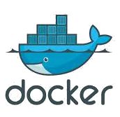
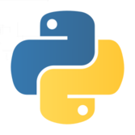
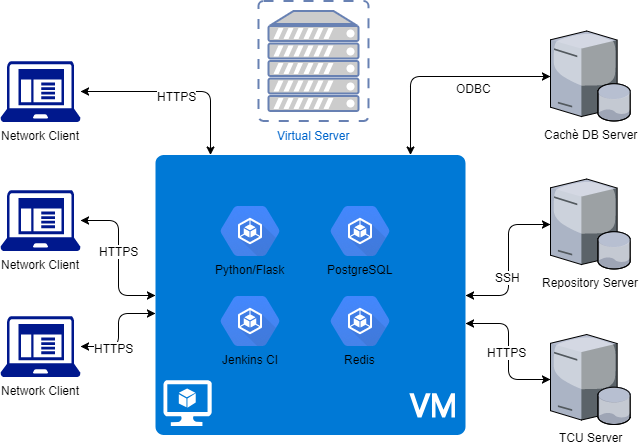

## Dados auditáveis para o TCU

### Solução com Docker e Python

Hildeberto Abreu Magalhães (PUG-PB)

---

### O problema

* Importar dados massivos da aplicação de gestão de pessoal
* Submeter checklists - validações do TCU
* Gerar arquivo em layout pré definido
* Transmitir arquivos ao gerenciador do TCU 
* Verificar arquivos de retorno
* Rastrear quem faz o quê, e quando
* Qualquer servidor público executará a tarefa

---

### Arquitetura de aplicação na web

---

### Porquê Docker?

* Arquitetura simplificada
* Instalação padronizada (desenvolvimento e produção)
* Deploy simplificado (CI/CD)
* Portabilidade
* Escalabilidade (Swarm, Kubernetes)
* Economia de recursos

---

### Porquê Python?

* Aprendizado com curva amena, para novas tecnologias ainda não utilizadas pela equipe
* Facilidade em construir software web
* Bibliotecas estáveis e verificadas pelo uso
* Facilidade nos testes e na manutenção
* Codificar em Python é divertido!

---

### Arquitetura de solução

---

### Importação - Desafios e soluções

* SQL retorna 25000 linhas/mês em 20 minutos
    * Dividir a importação por assuntos, usando threads e async
* Flexibilidade de fonte de dados (Cachè -> Oracle)
    * Fontes de dados e SQLs de extração em tabelas
* Diferenças do sistema atual e do TCU
    * Filtros e adaptações no processo de geração

**PyODBC, SQLAlchemy, psycopg2, celery**

---

### Checagem - Desafios e soluções

* validações cadastrais básicas (conceituais, históricas)
    * registrar regras por item de layout
    * agendar lista de checagens
* validações específicas do TCU (formatação, ausência de informação, ausência de informações relacionadas)
    * aprender com os arquivos de retorno do gerenciador do TCU 

**SQLAlchemy, celery, Python packages específicas (futuro NLTK, ML)**

---

### Geração - Desafios e soluções

* processamento de filtros (mapeamento TRT13 -> TCU)
* resultados gerados em arquivos-texto e tabelas
* processamento de validações específicas no arquivo-texto gerado
    * agendamento, usando threads para processamento de filtros, geração de arquivos em disco e espelhamento em tabelas
* acompanhamento histórico, com versionamento dos arquivos gerados

**SQLAlchemy, celery, Python packages específicas, Git**

---

### Transmissão - Desafios e soluções

* área de gerenciamento do TCU não é amigável
* não existe webservice para transmissão
* manualmente a princípio, mas o ideal seria automatizar

**Selenium, PyAutoGUI, etc**

---

### Resultados - Desafios e soluções

* retorno na interface (javascript)
* não existe webservice para retorno de processamento
* texto de retorno para “minerar” (palavra “ERRO” no texto, número da linha, descrição do erro)
* feito manualmente a princípio, mas o ideal seria automatizar

**SQLAlchemy, regex**

---

### Auditoria e Log - Desafios e soluções

* Rastrear quem faz o quê, e quando
    * logging de aplicação
    * auditoria de usuários no banco de dados

**SQLAlchemy hooks, logging**

---

#### Interface de usuário - Desafios e soluções

* Usuários de áreas e conhecimentos diversos
* Muitas funcionalidades complexas (síncronas e assíncronas)
* UIX deve ser amigável e acessível
* Reduzir tarefas a clique de botões
* Informação para tomada de decisão (próximos passos)
* Possibilidade de uso mobile (opcional)

**python-ldap, celery, Flask + MD Bootstrap**

---

### Planejamento de releases

| Versão | Entregas |
| ------ | -------- |
| 0.1 | Importação, Checagem, Geração (Painéis administrativos) |
|     | Log de aplicação |
| 0.2 | Verificação de retorno automatizada |
|     | Auditoria (Painéis administrativos |
| 0.3 | Transmissão automatizada, se possível |
|     | Painel de transmissão, se necessário |

---

### Testes automatizados

* Onde for possível
- TDD
- BDD
- Selenium

---

### Perguntas?

### Sugestões?

---

## Obrigado!

https://speakerdeck.com/hilam

https://github.com/hilam

https://twitter.com/__hilam__

hildeberto@gmail.com

http://pb.python.org.br

